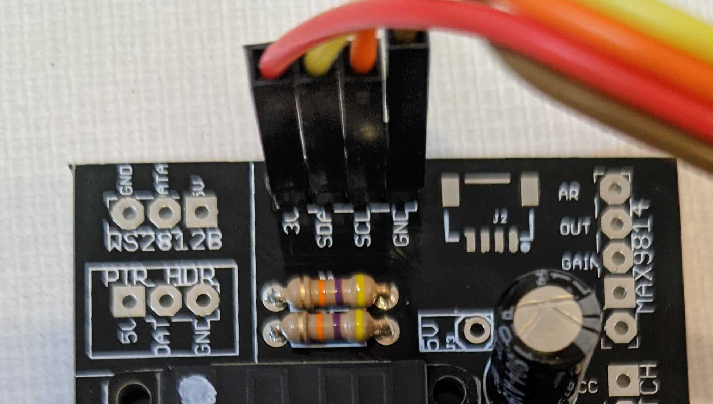

# Notes about the Air Quality Monitor Furball


## Wiring the OLED Display

The original Furball didn't use a display. We'll attach the OLED display to the four pin I2C header at the top middle of the board. If you can, solder a 4 pin header strip to the board and use female-to-female jumper wires. The I2C header wasn't designed specifically for this OLED display, so its pins are in a slightly different order.
- 3V to VCC
- SDA to SDA
- SCL to SCL
- GND to GND



## Configuring Software

1. Copy `src/config.h-example` to `src/config.h`
2. Edit `src/config.h` to set up to three sets of wifi network credentials to connect to.
3. If you're using the external OLED display, set `DISPLAY_SCREEN_INTERVAL` to the number of milliseconds a screen will display before it swtiches to the next screen.
4. If you're using the external OLED display, set `DISPLAY_SCREENS` to an array of screen types (see below) that select the set of screens you'll see.
3. If you're using the external OLED display, set `DISPLAY_SCREEN_MESSAGE_TEXT` to the text message that the message screen will display.

## Configuring Screens

If you're using it, the OLED display will cycle between showing multiple values. You can select the set of values it will show. Configure the array of values using the `DISPLAY_SCREENS` constant in `src/config.h`.

The available screen types are listed in `src/display.h`. They include:
-  `DISPLAY_SCREEN_MESSAGE` - shows a fixed text message defined by `DISPLAY_SCREEN_MESSAGE_TEXT`
-  `DISPLAY_SCREEN_TIME` - shows the current time
-  `DISPLAY_SCREEN_TEMPERATURE` - shows the current temperature in C
-  `DISPLAY_SCREEN_HUMIDITY` - shows the current relative humidity
-  `DISPLAY_SCREEN_PRESSURE` - shows the current air pressure
-  `DISPLAY_SCREEN_VOC` - shows the current gas resistance reading from the BME680
-  `DISPLAY_SCREEN_PM1` - shows the current PM1 density from the PMS5003
-  `DISPLAY_SCREEN_PM2_5 ` - shows the current PM1 density from the PMS5003
-  `DISPLAY_SCREEN_PM10 ` - shows the current PM1 density from the PMS5003
-  `DISPLAY_SCREEN_LUX` - shows the current light intensity in lux
-  `DISPLAY_SCREEN_INFRARED` - shows the current infrared light intensity
-  `DISPLAY_SCREEN_IP` - shows the current IP address

For example, if you want to cycle every 10 seconds between a screen that says "Hello World", one that shows the time and one that shows the temperature, you'd use these lines:
```
#define DISPLAY_SCREEN_INTERVAL 10000
#define DISPLAY_SCREENS { DISPLAY_SCREEN_MESSAGE, DISPLAY_SCREEN_TIME, DISPLAY_SCREEN_TEMPERATURE }
#define DISPLAY_SCREEN_MESSAGE_TEXT "Hello World"
```

If you want to always show the PM2.5 density and nothing else, you'd use these lines:
```
#define DISPLAY_SCREEN_INTERVAL 0
#define DISPLAY_SCREENS { DISPLAY_SCREEN_PM2_5 }
#define DISPLAY_SCREEN_MESSAGE_TEXT "this doesn't matter but must still be defined"
```

